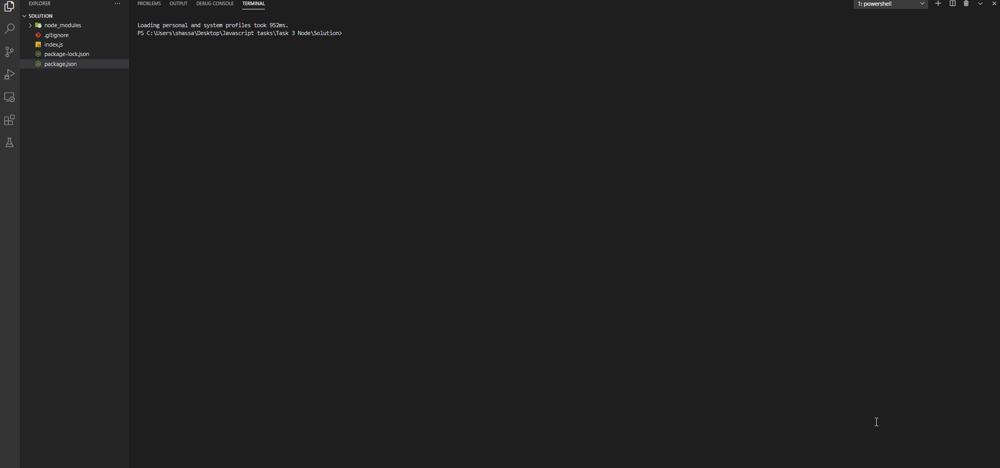

# NodeJS-console-application
This project is a nodeJs console application which has different features. 

## Features
* ` Print main menu that show the different features in the system and validate the input of user. 
* ` Read the package.json file and show it on console.
* ` Read OS information and show it in the console. 
* ` Start a HTTP server on port 8080.

### Usage

